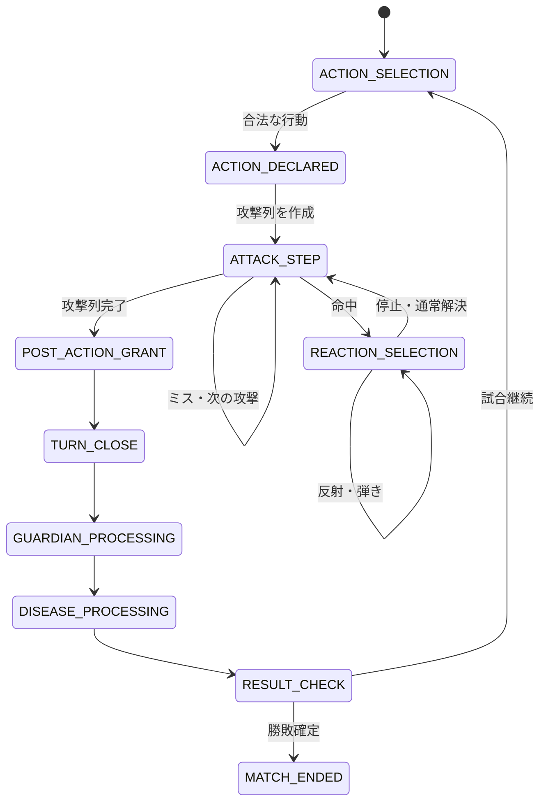

# GoodField バトルシステム解決順仕様

- 文書状態: Release 1.0
- 更新日: 2026-07-26
- 互換対象: 2026-07-24時点のゴッドフィールド現行Web版
- 対象範囲: 行動宣言、攻撃列、命中、防御、反射・弾き・停止、ダメージ、反撃、補充、ターン終了時自動効果

> [!IMPORTANT]
> `godfield-flash` は旧Flash版の公式サーバー実装ではなく、2016年頃の挙動を再現した
> 非公式サーバーエミュレーターである。READMEには神器分布と霧を含む既知の不一致が
> 明記されている。本書では処理構造を確認する歴史資料として使用し、現行公式教典、
> 現行Web版の実機観測、`GAME_RULE_SPEC.md` 14章と衝突する値は採用しない。

## 1. 規範関係と採用基準

本書は `GAME_RULE_SPEC.md` のうち、攻撃開始から次の通常手番を開くまでの解決順を
実装可能な粒度へ分割した規範仕様である。

| 領域 | 正本 |
|---|---|
| 初期値、カード定義、属性表、授与確率、災い、守護神、終末 | `GAME_RULE_SPEC.md` |
| 行動宣言後の攻撃列、反応、ダメージ、補充、ターン終了処理 | 本書 |
| コマンド、イベント、Revision、再送 | `PROTOCOL.md` |
| 画面状態、入力表示、演出待ち | `GAME_UI_FLOW_SPEC.md` |

矛盾時は次の順で判断する。

1. 現行公式教典と現行Web版の再現観測を優先する。
2. `GAME_RULE_SPEC.md` 14章の確定規則を優先する。
3. 現行仕様に記載がない処理境界は、`godfield-flash` と現行エンジンの両方で一致する
   構造を採用候補にする。
4. 歴史資料だけに存在する数値や挙動は自動採用しない。
5. 採用できない差分は10章の互換差分表へ残す。

## 2. 解決単位

| 用語 | 定義 |
|---|---|
| 行動 | アクティブプレイヤーが1回の通常手番で宣言する操作 |
| 攻撃列 | 1行動から作られる、対象と攻撃回数を固定した一連の攻撃 |
| 攻撃ステップ | 1対象に対する1回分の命中、反応、ダメージ解決 |
| 反応窓 | 現在の攻撃または相手向けカードの対象だけが、防御・はね返し・「許す」を宣言できる入力境界 |
| 反応連鎖 | 反射または弾きで攻撃者と対象が変わり、新しい反応窓を開く連鎖 |
| 原子的効果 | ダメージ、回復、状態付与、カード移動など、途中に別入力を挟まない最小変更 |
| 補充バッチ | 攻撃列で消費した神器を、攻撃列完了後にまとめて授与へ変換する処理 |

必須不変条件:

1. サーバーだけが合法性、対象、乱数、イベント順を確定する。
2. コマンド全体の検証が成功するまで、カード、MP、HP、乱数状態を変更しない。
3. 同じルールセット、初期状態、シード、コマンド列から同じイベント列を生成する。
4. `pendingAction` は同時に最大1件とし、反応中に別の通常行動を受け付けない。
5. 攻撃列の途中で通常手番を進めず、途中補充もしない。
6. 各原子的HP減少の直後にHP0割り込みを検査する。
7. クライアントの表示完了はルール解決を変更しない。

## 3. 状態遷移



反応を必要とする守護神攻撃または超常現象攻撃は同じ `ATTACK_STEP` と
`REACTION_SELECTION` を使用する。完了後の戻り先だけを、通常手番、守護神処理、
超常現象処理のいずれかへ固定する。

## 4. 行動宣言と攻撃列の作成

### 4.1 合法な攻撃構成

1. 攻撃構成には、非加算の主攻撃をちょうど1つ含めなければならない。
2. 主攻撃へ0個以上の加算攻撃、攻撃倍化、全体化、二回化、属性付与、
   MP無料化を組み合わせてよい。
3. 手札神器と習得済み奇跡は別ID空間で検証し、各配列内の重複IDを拒否する。
4. 選択した手札神器は本人の現在の手札に存在しなければならない。
5. 選択した習得済み奇跡は本人が現在習得中でなければならない。
6. 対象は宣言時点で生存する敵でなければならない。全体攻撃または霧による
   再決定前でも、クライアントが送る基準対象は合法な敵でなければならない。
7. MP不足、非対応効果、重複選択、不正対象のいずれかがあれば、イベントを1件も
   生成せずコマンド全体を拒否する。

### 4.2 攻撃値、MP、属性の固定順

合法性確認後、次の順で攻撃列の値を固定する。

```text
1. 各攻撃源の基礎攻撃値を合計する
2. 攻撃倍化があれば合計値を2倍する
3. MP消費量を確定する
4. 基礎属性を合成する
5. 属性染色があれば合成後の属性を上書きする
6. 命中率、攻撃回数、対象列を確定する
```

MP消費の優先順:

1. MP無料化が含まれる場合は、その行動で選択した奇跡の合計消費を0とする。
2. それ以外で全MP消費効果が含まれる場合は、宣言時点のMPをすべて消費する。
3. それ以外は、選択した奇跡の必要MPを合計する。

属性合成:

| 入力 | 結果 |
|---|---|
| 属性源なし | 無属性 |
| 同じ1属性だけ | その属性 |
| 無属性を含む複数属性 | 無属性 |
| 闇だけ | 闇 |
| 闇と別属性 | 無属性 |
| 光と火・水・木・土のいずれか1種 | 光以外の属性 |
| 火・水・木・土の異なる2種以上 | 無属性 |

属性染色が複数選択された場合は、サーバーが確定した攻撃源順で最後の染色を採用する。
確定順は `cardInstanceIds` の順、その後に `learnedMiracleIds` の順とする。

### 4.3 コスト確定

攻撃列を作成する直前に、次のイベントを順に確定する。

1. `ACTION_DECLARED`
2. 手札攻撃源を確定順に処理し、通常神器なら `CARD_CONSUMED`、初めて使う
   奇跡なら `MIRACLE_LEARNED`
3. 習得済み奇跡ごとの `MIRACLE_CAST`
4. MP消費が1以上なら `MP_SPENT`
5. 最初の `ATTACK_CREATED`

命中結果にかかわらず、宣言済みの攻撃神器とMPは戻さない。初回使用した奇跡は
攻撃宣言時に手札から習得領域へ移り、攻撃列完了時の補充対象になる。

## 5. 対象、攻撃回数、命中

### 5.1 対象列

1. 単体攻撃は宣言対象1人を対象列にする。
2. 攻撃者が霧状態なら、生存する敵から1人を等確率で選び、宣言対象を置き換える。
3. 全体攻撃は宣言時点の生存敵全員を候補にし、決定論的乱数で対象順を1回だけ
   シャッフルして固定する。
4. 全体攻撃は対象列の順に1人ずつ完全解決する。同時ダメージにはしない。
5. 対象列の処理前に対象が昇天済みなら、その対象をスキップする。

### 5.2 攻撃ステップ順

反復順は「対象が外側、攻撃回数が内側」とする。

```text
for target in fixedTargetOrder:
  for attackNumber in 1..totalAttacks:
    resolveAttackStep(target, attackNumber)
    if target ascended:
      break
```

したがって二回全体攻撃は、対象Aの1回目、対象Aの2回目、対象Bの1回目、
対象Bの2回目の順になる。

### 5.3 命中

1. 各攻撃ステップで独立して命中判定する。
2. 命中率100%では乱数を消費しない。
3. 対象が暗雲状態なら必ず命中し、命中乱数を消費しない。
4. ミスした攻撃ステップは反応窓、ダメージ、命中時効果、反撃を作らない。
5. ミス後は次の攻撃回数または次の対象へ進む。
6. 命中した場合は攻撃値が0でも反応窓を作る。

## 6. 反応と防御

### 6.1 反応コマンドの検証

1. 現在の `reactionId` と攻撃または相手向けカードの対象が一致する本人だけが反応できる。
2. 相手向けの非攻撃カードも効果解決前に反応窓を作り、通常防具ではなく「何でもはね返す」効果または「許す」だけを合法とする。
3. はね返しで対象が変わるたびに新しい `reactionId` の反応窓を作り、はね返しのはね返しも同じ手順で処理する。
4. 空の防御選択を「許す」として受理する。
5. 手札から使った防具は直ちに手札から除く。同じ攻撃列の後続ステップでは
   再使用できない。
6. 習得済み奇跡は手札消費なしで再使用できるが、その都度MPを支払う。
7. 手札から初めて使う防御奇跡は習得領域へ移し、補充対象にする。
8. 閃光中に選択できる防御神器は最大1枚とする。習得済み奇跡は神器枚数へ数えない。
9. 1回の反応で停止、反射、弾きは合計最大1効果とする。
10. 通常防御値を持たず、停止、反射、弾き、反撃、属性濾過のいずれも持たない
   カードは拒否する。
11. 反応全体の検証完了前にカードやMPを消費しない。

### 6.2 反応内の処理順

```text
1. 属性濾過の有無を判定
2. 濾過後の属性で全防御源の合法性を検証
3. 合計防御値を計算
4. REACTION_DECLARED
5. 属性濾過を確定
6. 手札の防御神器を消費し、手札の防御奇跡を習得
7. 手札防御源による自分への災い、手札一新などの即時自己効果
8. 習得済み防御奇跡を詠唱
9. 反応MPを消費
10. 停止、反射、弾き、または通常ダメージへ分岐
```

属性濾過で無属性になった攻撃は、現在の反応連鎖と、同じ攻撃列の残りの攻撃ステップで
その属性を維持する。

### 6.3 停止

1. 停止は現在の攻撃ステップを終了する。
2. ダメージ、命中時災い、吸収、自傷、反撃は発生しない。
3. 攻撃列に次の攻撃回数または対象があれば、そこから継続する。

### 6.4 反射

1. 現在の防御者を新しい攻撃者とする。
2. 直前までの攻撃者を新しい対象とする。
3. 攻撃ID、攻撃値、属性、攻撃源、命中済みという事実を維持する。
4. 命中判定をやり直さず、新しい対象へ新しい `reactionId` の反応窓を作る。

### 6.5 弾き

1. 現在の防御者を新しい攻撃者とする。
2. 生存者全員から等確率で新しい対象を選ぶ。敵味方と弾き使用者本人を除外しない。
3. 攻撃ID、攻撃値、属性、攻撃源、命中済みという事実を維持する。
4. 弾き使用者本人へ戻った場合は新しい反応窓を作らず、防御値0で直ちに解決する。
5. それ以外は新しい `reactionId` の反応窓を作る。

### 6.6 反応連鎖の安全上限

ゲームルール上の反応回数上限は設けない。サーバー保護のため、同一攻撃ステップの
反応深度が512へ到達した場合は `REACTION_CHAIN_ABORTED` を記録し、その攻撃ステップを
ダメージなしで打ち切る。この保護上限はルールセットへ固定し、無言で変更しない。

## 7. 通常ダメージと付随効果

停止、反射、弾きが選ばれなかった反応は次の順で解決する。

```text
1. residual = max(0, attackPower - totalDefense)
2. 闇かつresidual > 0なら、damage = 対象の現在HP
3. それ以外はdamage = residual
4. DAMAGE_APPLIED
5. 対象のHP0割り込み
6. HP減少があれば対象守護神の10%離脱判定
7. damage > 0なら命中時災いを付与
8. damage > 0なら吸収を解決
9. damage > 0なら自傷を解決し、自傷者のHP0割り込みと守護神離脱判定
10. damage > 0なら反撃を選択順に解決
11. 次の攻撃ステップへ進む
```

追加規則:

1. 闇攻撃も防御で残余0ならHPを減らさない。
2. 命中時災い、吸収、自傷、反撃は残余ダメージが1以上の場合だけ発生する。
3. 吸収量とダメージ比例反撃の基準値は、計算済みの `damage` とする。
4. 自傷量は防御後の残余ではなく、その攻撃ステップの攻撃値とする。
5. ダメージ比例反撃は受けたダメージの1倍または2倍を使用する。
6. 吸収は現在の攻撃者が生存中、自傷は元の行動者が生存中の場合だけ解決する。
7. HP0割り込みで太陽のお守りを使用した場合はHP10で復活し、お守り1枚を
   復活補充数へ加える。
8. 太陽のお守りがない場合の昇天弓は、75%の独立命中判定と30ダメージを
   昇天確定前に解決する。
9. すべてのHP0割り込み後もHP0なら昇天を確定する。

## 8. 攻撃列完了と補充

攻撃列の全攻撃ステップが完了するまで補充しない。完了後は次の順で授与義務を解決する。

1. 行動者が手札から使用した攻撃神器を、宣言時の枚数分だけ補充する。
2. 防御者が手札から使用した神器を、最初に防御へ参加した順で使用枚数分だけ補充する。
3. HP0割り込みで使用した太陽のお守りを、最初に使用した順で補充する。
4. 各授与中の悪魔、手札上限、HP0は `GAME_RULE_SPEC.md` の授与規則で逐次解決する。
5. 授与中に対象が昇天した場合、その対象の残り授与義務を破棄する。
6. 通常行動なら補充バッチ完了後に `TURN_CLOSED` を記録する。
7. 守護神または超常現象から開始した攻撃なら、通常手番を閉じず呼び出し元の
   自動処理位置へ戻る。

二回攻撃では1回目の防具を2回目に使えず、1回目と2回目の間に補充しない。
全体攻撃でも対象ごとの途中補充を行わない。

## 9. ターン終了時自動効果と勝敗

通常行動と補充バッチの完了後、次の順を固定する。

```text
1. TURN_CLOSED
2. 敵側守護神の候補列を席順で固定
3. 各守護神について25%行動判定
4. 行動する守護神の重み付き行動抽選と解決
5. 防御入力が必要なら自動処理を停止し、解決後に次の守護神から再開
6. 全守護神処理後、手番プレイヤーの病を5%で悪化判定
7. 悪化後の病効果を適用
8. POST_TURN_AUTOMATIC_EFFECTS_COMPLETED
9. 勝敗確定
10. 継続時だけGFを1増やし、固定手番列の次の生存者へ進む
```

守護神処理中に勝敗候補が生じても、候補列に残る守護神処理を続ける。病処理も完了した後に
勝敗を確定する。同一ターンに2人以上が敗北した場合は引き分けとする。

手番列は試合開始時に1回だけ無作為化し、試合中は固定する。昇天者を飛ばして循環し、
各巡回で再シャッフルしない。

## 10. `godfield-flash` から得た歴史的知見

### 10.1 採用した構造

| 歴史実装の構造 | 現行仕様への反映 |
|---|---|
| 行動宣言時に神器・奇跡を消費し、攻撃データをキュー化 | 4.3節 |
| 全体攻撃を対象別の攻撃データへ分割 | 5.1、5.2節 |
| 命中時だけ防御入力を開く | 5.3節 |
| 反射・弾きで同じ攻撃を対象変更し、再度防御を求める | 6.4、6.5節 |
| 防御後の残余が正のときだけ反撃を作る | 7章 |
| 攻撃キュー完了後に使用枚数分を補充 | 8章 |
| ターン末の自動処理が防御入力で停止し、入力後に再開 | 9章 |
| 夢の偽表示をカード実体と分離して保持 | `GAME_RULE_SPEC.md` OPEN-10確定規則の補強 |
| 取引不足分を所持金、MP、HPの順に徴収 | `GAME_RULE_SPEC.md` OPEN-02確定規則の補強 |

参照箇所:

- [`turn.py`](../godfield-flash/server-src/modules/turn.py): 攻撃キュー、命中、反応、ダメージ
- [`room.py`](../godfield-flash/server-src/modules/room.py): 手番、補充、病、守護神、勝敗
- [`player.py`](../godfield-flash/server-src/modules/player.py): リソース、病、夢、手札、奇跡
- [`item.py`](../godfield-flash/server-src/modules/item.py): 属性防御とカード命令
- [`assistant.py`](../godfield-flash/server-src/modules/assistant.py): 旧守護神モデル
- [`ItemData.CSV`](../godfield-flash/server-src/ItemData.CSV): 旧カード効果データ

### 10.2 採用しない差分

| 論点 | `godfield-flash` | GoodField確定規則 | 判断 |
|---|---|---|---|
| 初期手札 | 10枚 | 9枚 | 現行実機を優先 |
| 手札上限 | 16枚 | 18枚 | 現行Wikiと現行仕様を優先 |
| 上限到達時の授与 | 新しい神器の追加を拒否 | 新しい神器を保持し、取得前の手札から1枚破棄 | `OPEN-16`確定規則を優先 |
| 手番順 | 参加者1巡ごとに再シャッフル | 開始時に1回だけ固定 | 決定論と現行実装へ固定 |
| 光攻撃 | 闇属性防具で防御可能 | 通常属性防具では防御不可 | 現行公式教典を優先 |
| 病の自然悪化 | 0%から毎回1ポイント増加 | 毎回5% | 現行公式・Wikiを優先 |
| 守護神行動率 | 30% | 25% | 現行公式教典を優先 |
| 守護神の耐久 | HP20で宿主ダメージを肩代わり | 独立HPなし | 現行守護神仕様を優先 |
| 補充タイミング | 病と守護神を含むターン末キューの後 | 攻撃列の直後、守護神と病の前 | `OPEN-05`確定規則と現行エンジンのイベント境界へ固定 |
| 病と守護神の順 | 病の後に守護神 | 守護神の後に病 | `OPEN-05`確定規則を優先 |
| 勝敗候補後の自動効果 | 勝敗条件成立時は守護神処理を開始しない場合がある | 候補列の守護神と病を完了してから勝敗確定 | `OPEN-12`確定規則を優先 |
| 全体攻撃対象順 | 部屋のプレイヤー列順 | サーバーが無作為順を固定 | `OPEN-08`確定規則を優先 |
| MP無料化 | 隣接する直前の奇跡1つを無料化 | 同一行動の奇跡コストを無料化 | 現行カード命令へ固定 |
| 「買う」の支払い | 所持金だけで購入可否を判定 | 所持金、MP、HPの合計で判定 | 現行取引仕様へ固定 |
| 神器分布 | 旧CSV。READMEで不正確と明記 | 現行公式定義237候補、重み500 | 旧CSVを抽選正本にしない |
| 霧 | READMEで未完成と明記 | 現行仕様の対象無作為化 | 旧実装を正本にしない |

### 10.3 歴史資料でも断定しない事項

1. Flashクライアントの演出順とサーバー内部イベント順が同一だったか。
2. 非公式エミュレーターの未実装、バグ、作者の推測の境界。
3. 2016年当時の公式サーバーが、エミュレーターと同じ乱数消費順だったか。
4. 旧CSVの0重み項目が、別モード、守護神、デバッグ用のどれに属したか。
5. 現行Web版までの間に変更された正確なバージョンと変更日。

## 11. 受け入れ条件

| ID | シナリオ | 必須結果 |
|---|---|---|
| BTL-01 | 不正な複合攻撃 | カード、MP、乱数、イベント列が変化しない |
| BTL-02 | 命中率攻撃がミス | 反応窓とダメージなし。攻撃神器は攻撃列完了後に補充 |
| BTL-03 | 二回攻撃 | 独立した反応窓を2回作り、途中補充しない |
| BTL-04 | 全体攻撃 | 対象順を1回固定し、対象ごとに逐次解決 |
| BTL-05 | 閃光中の防御 | 防御神器2枚を拒否し、1枚または許すを受理 |
| BTL-06 | 反射 | 攻撃IDを維持し、攻撃者へ新しい反応窓 |
| BTL-07 | 弾きが使用者へ戻る | 追加反応なしで防御値0のダメージ |
| BTL-08 | 停止 | ダメージ、命中時効果、吸収、自傷、反撃なし |
| BTL-09 | 闇を完全防御 | HP減少と昇天なし |
| BTL-10 | 闇の残余1以上 | 対象HPを0にしてHP0割り込み |
| BTL-11 | 命中時災い | 正のダメージ後にだけ付与 |
| BTL-12 | 太陽のお守り | 昇天前にHP10で復活し、列完了後に1枚補充 |
| BTL-13 | 複数防御者の補充 | 攻撃側、防御参加順、復活使用順で補充 |
| BTL-14 | 守護神攻撃で防御待ち | 入力後に未処理の守護神から再開 |
| BTL-15 | 守護神中の勝敗候補 | 守護神全員と病を処理してから勝敗確定 |
| BTL-16 | 513段目の反応要求 | 深度512で監査イベントを残し、ダメージなしで安全終了 |

主な自動テストは [`tests/engine.test.ts`](../tests/engine.test.ts) の次のケースで追跡する。

- `a basic attack opens an independent reaction and grants used cards after defense`
- `a two-hit weapon creates two reactions and grants defense cards only after both`
- `an all-enemy attack resolves targets one at a time in deterministic random order`
- `reflections reuse the attack ID and create a new reaction for every target change`
- `a failed bounce returning to its user deals damage without another reaction`
- `rainbow curtain filters an elemental attack before ordinary defense`
- `dark residual damage sets HP to zero and ends a two-player match`
- `a fully defended dark attack deals zero damage and does not ascend its target`
- `sun amulet interrupts HP zero before ascension`
- `a guardian attack pauses for defense and resumes remaining automatic effects`
- `all queued guardians are checked before a guardian-caused match result`
