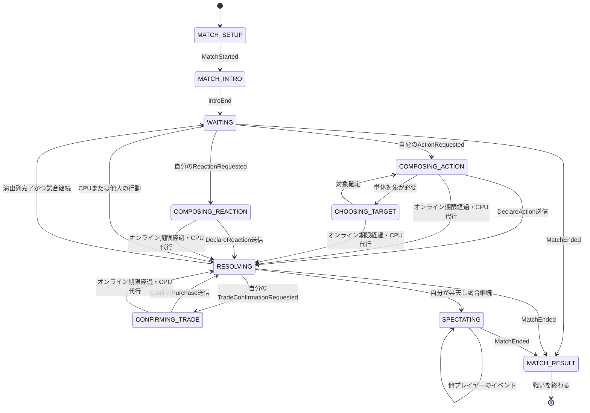

# GoodField ゲームロジック・UIロジック・UI遷移仕様

- 文書状態: Draft 3
- 作成日: 2026-07-24
- 更新日: 2026-07-25
- 対象: Web版、2～9人個人戦を前提とする対戦画面
- 参照: `GAME_RULE_SPEC.md`
- 追加根拠: 2026-07-24の公式Web版「修行者4人・終末の時 G.F.1」1戦、および2026-07-25の同条件での再プレイ・時間計測とユーザー手動操作によるG.F.38昇天までの記録
- 追加規定: 2026-07-25に回答された`GAME_RULE_SPEC.md`の`OPEN-*`とプロジェクト判断

## 1. 仕様の読み方

本書では根拠を次の3種類に分ける。

- `RULE`: `GAME_RULE_SPEC.md`で確定済みのゲーム規則。
- `OBSERVED`: 公式Web版の4人修行で画面または操作として確認した挙動。
- `PROJECT`: GoodFieldで採用する実装上の規定。元ゲームの内部実装を断定するものではない。

調査時の未確認事項は旧`UI-OPEN-*`番号で追跡し、初回リリースの実装規則または
明示的な対象外として13章で確定する。

## 2. 責務の分離

### 2.1 サーバーの責務

サーバーをゲーム状態の唯一の正本とする。`PROJECT`

サーバーだけが次を決定する。

1. 現在の `GamePhase` とアクティブプレイヤー。
2. 行動・対象・防御の合法性。
3. カード効果、ダメージ、回復、取引、授与、昇天、勝敗。
4. 乱数を使う全処理。
5. 公開情報とプレイヤー別非公開情報。
6. 入力期限と時間切れ時処理。

クライアントから送られたダメージ値、対象候補、MP残量、勝敗は信用しない。

### 2.2 ゲームロジックの責務

ゲームロジックはUIを参照しない決定論的な状態遷移として実装する。`PROJECT`

```ts
type ReduceResult = {
  state: MatchState;
  events: DomainEvent[];
};

function handleCommand(
  state: MatchState,
  command: GameCommand,
  rng: DeterministicRng,
): ReduceResult;
```

同じ初期状態、コマンド列、乱数列からは、同じ最終状態とイベント列を生成しなければならない。

### 2.3 UIロジックの責務

UIは次だけを行う。`PROJECT`

1. サーバーのスナップショットとイベントを表示用状態へ変換する。
2. 手札、行動、対象、防御の一時選択を保持する。
3. 合法手だけを選択可能にする。
4. 確定操作をコマンドとしてサーバーへ送る。
5. サーバーイベントを順番に演出する。

UIのアニメーション完了、クリック順、端末時刻をゲーム結果の根拠にしてはならない。

## 3. 状態モデル

### 3.1 サーバーゲームフェーズ

`GAME_RULE_SPEC.md`の `GamePhase` をそのまま使用する。

```ts
type GamePhase =
  | "LOBBY"
  | "INITIALIZING"
  | "INITIAL_GRANT"
  | "TURN_OPEN"
  | "ACTION_SELECTION"
  | "TARGET_SELECTION"
  | "ACTION_DECLARED"
  | "REACTION_SELECTION"
  | "ACTION_RESOLUTION"
  | "POST_ACTION_GRANT"
  | "TURN_CLOSE"
  | "POST_TURN_AUTOMATIC_EFFECTS"
  | "RESULT_CHECK"
  | "MATCH_ENDED";
```

### 3.2 クライアントUIモード

サーバーフェーズと画面表示は1対1にしない。複数の内部フェーズを1つの演出画面で扱えるようにする。`PROJECT`

```ts
type UiMode =
  | "MATCH_SETUP"
  | "MATCH_INTRO"
  | "WAITING"
  | "COMPOSING_ACTION"
  | "CHOOSING_TARGET"
  | "COMPOSING_REACTION"
  | "CONFIRMING_TRADE"
  | "RESOLVING"
  | "SPECTATING"
  | "MATCH_RESULT";
```

```ts
type UiInteractionState = {
  mode: UiMode;
  selectedActionCardIds: string[];
  selectedLearnedMiracleIds: string[];
  selectedDefenseCardIds: string[];
  selectedTargetIds: string[];
  lastSelectedTargetId: string | null;
  awaitingCommandId: string | null;
  inputDeadlineAt: string | null;
  interactionLocked: boolean;
};
```

### 3.3 プレイヤー別ビュー

```ts
type PlayerPublicView = {
  playerId: string;
  displayName: string;
  seatIndex: number;
  controller: "HUMAN" | "CPU";
  connectionState: "CONNECTED" | "DISCONNECTED";
  hp: number;
  mp: number;
  money: number;
  alive: boolean;
  calamities: CalamityPublicView[];
  guardian: GuardianPublicView | null;
};

type SelfPrivateView = {
  playerId: string;
  hand: CardInstanceView[];
  learnedMiracles: LearnedMiracleView[];
  legalActions: LegalActionView[];
};

type GameViewState = {
  matchId: string;
  revision: number;
  phase: GamePhase;
  gfCount: number;
  endTimeAt: number | null;
  activePlayerId: string | null;
  actingPlayerId: string | null;
  targetPlayerIds: string[];
  players: PlayerPublicView[];
  self: SelfPrivateView;
  result: MatchResultView | null;
};
```

対戦相手の手札内容と習得済み奇跡の非公開情報は配信しない。`PROJECT`

## 4. 画面構成

4人修行で確認した画面を、次の領域へ分割する。`OBSERVED`

| 領域 | 表示内容 |
|---|---|
| ヘッダー | 戻る、モード名、現在GF / 終末GF、教典 |
| 行動ヘッダー | 行動者名、矢印、単体対象名 |
| 行動領域 | 使用中の武器・奇跡・取引・自動効果と合計値 |
| 応答領域 | 防御カード、合計防御値、または「許す」 |
| プレイヤー一覧 | 全参加者の名前、HP、MP、所持金、状態 |
| 奇跡領域 | 習得済み奇跡 |
| 手札領域 | 操作プレイヤーの手札 |
| 操作領域 | 祈る、対象選択、確定操作 |
| 結果領域 | 勝敗種別、勝者名、終了操作 |

2～9人で同じ情報構造を使用し、プレイヤー一覧だけを人数に応じてスクロールまたは縮小する。`PROJECT`

## 5. 入力規則

### 5.1 共通

1. `interactionLocked = true` の間はゲームコマンドを送信しない。
2. UI上のカード選択はローカル状態であり、確定前はサーバー状態を変更しない。
3. サーバーから新しい `revision` を受けたら合法手を再評価する。
4. 選択中カードが合法手から外れた場合は選択を解除し、理由を表示する。
5. 同じ確定操作の連打は同じ `commandId` で送信し、サーバー側で一度だけ処理する。

### 5.2 行動構成

1. 自分の `ACTION_SELECTION` のときだけ手札と習得奇跡を選択可能にする。`RULE`
2. 通常武器を選ぶと、以前選んだ通常武器を置き換える。`RULE`
3. 併用可能な奇跡は通常武器へ加算できる。`RULE`
4. 選択結果、合計攻撃値、属性、必要MPを行動領域へ即時表示する。`PROJECT`
5. 使用可能な武器がある場合、「祈る」は表示しても実行不可とする。`RULE`
6. 実行不可操作は無反応にせず、無効理由をツールチップまたは短文で示す。`PROJECT`

### 5.3 単体対象

1. 単体対象を必要とするカードを選ぶと対象選択へ入る。
2. 4人修行では武器選択直後に敵1人が対象欄へ表示された。`OBSERVED`
3. 別の生存敵のプレイヤーパネルを選ぶと、行動ヘッダーの対象名が変更された。`OBSERVED`
4. 昇天済みプレイヤーは対象候補に含めない。`RULE`
5. 前回選択した対象が現在も合法なら、そのプレイヤーを既定対象として維持する。`RULE`
6. 前回対象がない、または現在は不正な場合、表示中のプレイヤー一覧で自分を除く最上段の生存敵を既定対象とする。`RULE`
7. 既定対象の決定はUIローカルで行い、乱数を消費しない。`PROJECT`
8. 行動確定コマンドには、UI表示値ではなく明示した`targetPlayerId`を必ず含める。`PROJECT`

### 5.4 行動確定

選択済み行動カードのプレビュー領域全体を確定ボタンとして扱う。`PROJECT`

```ts
type DeclareActionCommand = {
  type: "DECLARE_ACTION";
  matchId: string;
  commandId: string;
  expectedRevision: number;
  actionCardIds: string[];
  learnedMiracleIds: string[];
  targetPlayerIds: string[];
};
```

送信後は `awaitingCommandId` を設定して入力をロックする。拒否された場合だけ、サーバーの最新状態へ同期して再選択可能にする。

### 5.5 防御応答

1. 攻撃または相手向けカードの対象になったプレイヤーだけが防御カードを選択できる。売る・買う・災い付与・神器除去などの非攻撃効果も、解決前に必ずこの応答を挟む。`RULE`
2. 防具は0枚以上選択できる。`RULE`
3. 選択した防具と合計防御値を応答領域へ表示する。
4. 0枚のまま確定すると「許す」として送信する。
5. 「許す」の文字だけでなく応答領域全体を押下可能にする。`PROJECT`
6. CPUが防御する場合も、選択防具または「許す」を人間と同じ応答領域に表示する。`OBSERVED`

```ts
type DeclareReactionCommand = {
  type: "DECLARE_REACTION";
  matchId: string;
  commandId: string;
  expectedRevision: number;
  attackId: string;
  reactionId: string;
  defenseCardIds: string[];
};
```

7. 反射または弾きで攻撃元・対象が変わった場合、サーバーから届く新しい`ReactionRequested`ごとに防御入力を作り直す。`RULE`
8. 反射・弾きの連鎖回数にUI独自の上限を設けない。`RULE`
9. 弾きに失敗して使用者自身へ戻った攻撃には、追加の防御入力を表示しない。`RULE`
10. 非攻撃カードには通常防具を使用できず、「何でもはね返す」効果または「許す」だけを選べる。はね返し後の新しい対象にも、別の`reactionId`で同じ防御入力を表示する。`RULE`

### 5.6 入力期限、切断、CPU代行

2026-07-25の公式Web版4人修行では、人間の防御入力を29.7秒以上放置しても入力画面が閉じず、CPU代行にも移行しなかった。したがって、15秒期限を公式修行の挙動として扱ってはならない。`OBSERVED`

1. 修行の人間入力には期限を設定せず、`inputDeadlineAt = null`とする。`PROJECT`
2. オンライン対戦の人間による行動・対象・防御・取引確認の入力期限は、要求ごとに15秒とする。`PROJECT`
3. `inputDeadlineAt`はサーバーがモード別に決定し、UIのカウントダウンは案内表示にだけ使用する。
4. 期限切れ時、クライアントは既定行動を送信しない。サーバーが対象プレイヤーを切断状態にし、操作権をCPUへ移す。`PROJECT`
5. CPUは期限切れ時点の保留中入力から代行し、以後の試合を継続する。`PROJECT`
6. UIは切断状態とCPU代行中であることをプレイヤーパネルに表示し、人間向け入力を閉じる。
7. 再接続時は最新スナップショットの`controller`を正本とし、CPUから人間へ操作権が戻ったと仮定しない。

### 5.7 取引確認

1. 「買う」で提示された商品は、価格が0でも購入確認を表示する。`RULE`
2. 購入した未使用の奇跡は習得済み奇跡領域へ移さず、手札へ追加する。`RULE`
3. 「売る」の支払いは所持金、MP、HPの順に表示し、各値を0～99の範囲で更新する。`RULE`
4. 商品移動後にHP0となった場合は、復活または昇天、勝敗判定、補充のサーバーイベント順に表示する。`RULE`
5. 「売る」で消費した取引神器と商品神器に対する補充は、合計1枚分として表示する。`RULE`

## 6. UI状態遷移



### 6.1 遷移表

| 現在UI | トリガー | 次UI | 表示 | 許可入力 |
|---|---|---|---|---|
| `MATCH_SETUP` | 対戦開始確定 | `MATCH_INTRO` | 全プレイヤー、初期値、開始演出 | なし |
| `MATCH_INTRO` | 開始演出終了 | `WAITING` | 初期手札、GF、プレイヤー一覧 | なし |
| `WAITING` | 自分の行動要求 | `COMPOSING_ACTION` | 手札、奇跡、祈る、合法手 | 行動選択 |
| `COMPOSING_ACTION` | 単体対象カード選択 | `CHOOSING_TARGET` | 選択行動、対象候補 | 生存敵の選択 |
| `CHOOSING_TARGET` | 対象決定 | `COMPOSING_ACTION` | 行動者→対象 | 再選択、行動確定 |
| `COMPOSING_ACTION` | 行動送信 | `RESOLVING` | 送信中表示 | なし |
| `COMPOSING_ACTION` / `CHOOSING_TARGET` | オンライン期限経過 | `RESOLVING` | 切断・CPU代行表示 | なし |
| `WAITING` | 自分への防御要求 | `COMPOSING_REACTION` | 攻撃と利用可能防具 | 防具選択、許す |
| `COMPOSING_REACTION` | 防御送信 | `RESOLVING` | 攻撃対防御 | なし |
| `COMPOSING_REACTION` | オンライン期限経過 | `RESOLVING` | 切断・CPU代行表示 | なし |
| `RESOLVING` | 自分への購入確認要求 | `CONFIRMING_TRADE` | 商品、価格、支払い見込み | 購入可否 |
| `CONFIRMING_TRADE` | 購入可否送信 | `RESOLVING` | 送信中表示 | なし |
| `CONFIRMING_TRADE` | オンライン期限経過 | `RESOLVING` | 切断・CPU代行表示 | なし |
| `WAITING` | 他人への行動・防御 | `RESOLVING` | 行動者、対象、カード、値 | なし |
| `RESOLVING` | 一連の演出終了 | `WAITING` | 更新後盤面 | なし |
| `RESOLVING` | 自分が昇天、他に複数生存 | `SPECTATING` | 灰色の自分、手札、他人の行動 | 観戦UIだけ |
| `SPECTATING` | 次のイベント | `SPECTATING` | CPU同士の攻防と自動効果 | 観戦UIだけ |
| 任意の対戦中UI | `MatchEnded` | `MATCH_RESULT` | 最終盤面、勝者名、終了操作 | 終了だけ |

## 7. イベント表示

### 7.1 ドメインイベント

最低限、次のイベントをサーバーから順序付きで配信する。`PROJECT`

```ts
type DomainEvent =
  | MatchStarted
  | InitialGrantCompleted
  | TurnOpened
  | ActionRequested
  | ActionDeclared
  | ReactionRequested
  | ReactionDeclared
  | TradeConfirmationRequested
  | TradeResolved
  | AtomicEffectResolved
  | GrantRequested
  | GrantResolved
  | InputTimedOut
  | PlayerDisconnected
  | ControlTransferred
  | GfCountChanged
  | PlayerAscended
  | TurnClosed
  | MatchEnded;
```

各イベントは `eventSeq`、`revision`、`occurredAt`、公開範囲を持つ。

### 7.2 演出キュー

1. クライアントは `eventSeq` 順に演出する。
2. HP、MP、所持金の確定値はサーバースナップショットを使用する。
3. ダメージ表示が終わる前に次のイベントを受けても、内部状態は先に同期してよい。
4. 演出スキップは表示時間だけを短縮し、イベントを破棄しない。
5. `MatchEnded` は先行イベントの昇天表示後に結果へ遷移させる。
6. 再接続時は古い演出を全再生せず、最新スナップショットと直近の重要イベントだけを表示する。

### 7.3 公式Web版の基準タイミング

2026-07-25に、デスクトップ幅1280px、修行者4人、終末の時G.F.1で、画面上の表示内容を50～80ms間隔で記録した。1戦・G.F.6までの標本であるため、通信や初期化を含む時間は固定値と断定せず、繰り返し現れた演出間隔だけを互換基準にする。`OBSERVED`

| 区間 | 実測 | GoodField互換値 |
|---|---:|---:|
| 対戦画面の準備完了後、開始メッセージを保持 | 6,055ms | 6,000ms |
| 行動カード→対象→防御・許す→次の表示の各段階 | 472～554ms | 各500ms |
| 「無事」またはダメージ結果の保持 | 941～1,030ms | 1,000ms |
| 悪魔表示→中央ダメージ表示 | 993～1,006ms | 1,000ms |
| 中央ダメージ表示→HP0・昇天表示 | 1,001～1,016ms | 1,000ms |
| 結果消去→GF更新→次行動表示の各段階 | 474～533ms | 各500ms |
| 手札・防具選択→プレビュー反映 | 100ms以内 | 同一描画フレーム |
| 防御入力の待機 | 29,700ms以上継続 | 修行では無期限 |
| 降参確定→修行選択画面 | 1,572ms | 1,500ms |

対戦開始クリックから対戦画面の準備完了までは約1,033msだったが、これは通信・初期化を含むため固定ディレイにしない。`MatchStarted`と初期表示準備の完了後に6,000msの開始演出を開始する。`PROJECT`

CPU専用の無作為な「思考待ち」は観測されなかった。CPU行動も、GF更新から約500ms後に行動カードを表示する同じ演出キューで表現する。`OBSERVED`

```ts
type PresentationTimingProfile = {
  introHoldMs: 6000;
  stageGapMs: 500;
  attackStageMs: 500;
  attackResultMs: 1000;
  resolutionHoldMs: 500;
  exitHoldMs: 500;
  localSelectionDelayMs: 0;
};

const OFFICIAL_WEB_2026_07_26: PresentationTimingProfile = {
  introHoldMs: 6000,
  stageGapMs: 500,
  attackStageMs: 500,
  attackResultMs: 1000,
  resolutionHoldMs: 500,
  exitHoldMs: 500,
  localSelectionDelayMs: 0,
};
```

1. 演出時間はドメインイベントへ埋め込まず、クライアントのバージョン付き表示プロファイルとして管理する。`PROJECT`
2. 攻撃カードを500ms表示した後、矢印と防御入力を同時に表示する。矢印と攻撃カードは防御側の選択完了まで保持し、確定後は使用した防御カードすべて、または「許す」を500ms表示する。`PROJECT`
3. 攻撃の「無事」とダメージ結果は1,000ms、付与された状態効果は1件につき500ms、攻撃以外の結果表示は表示プロファイルの`resolutionHoldMs`に従う。`PROJECT`
4. 手札、対象、防具のローカル選択は待ち時間を入れず、次の描画フレームでプレビューへ反映する。`PROJECT`
5. タブが非表示、端末が一時停止、またはイベントが滞留した場合も、経過時間だけで中間イベントを破棄しない。復帰時は順序を保ったまま残り時間を短縮できる。`PROJECT`
6. 操作プレイヤーの通常手番が開始したら、前のプレイヤーの行動プレビューを消し、自分の行動構成を空の状態から表示する。`PROJECT`

### 7.4 攻撃と防御

4人修行で、行動者→単体対象、攻撃カード、攻撃合計、CPU防具、防御合計が同一盤面上で順に表示された。`OBSERVED`

GoodFieldでは次の表示順を採用する。`PROJECT`

```text
攻撃カード（500ms）
  → 攻撃者から対象への矢印と防御入力（選択完了まで保持）
  → 使用した防御カードをすべて表示、または「許す」（500ms）
  → 「無事」または差分ダメージ（1,000ms）
  → 付与された病気などの状態効果を1件ずつ表示（各500ms）
  → 攻撃演出一式を消去
```

この順序はUI演出順であり、未確定の内部ルール順を上書きしない。

攻撃者が画面の閲覧者本人であっても同じ演出を省略しない。`PROJECT`
防御入力中の対象者には最初に攻撃カードだけを500ms表示し、その後、矢印と同時に防御選択欄と「許す」を操作可能にする。`PROJECT`

反射・弾きで新しい防御機会が発生した場合は、同じ`attackId`内の別`reactionId`として「対象表示→防御要求→防御宣言または許す」を繰り返す。売る・買う・災い付与・神器除去などの相手向け非攻撃カードも同じ反応連鎖を使う。弾き失敗による使用者自身への戻りだけは、防御要求を挟まず解決表示へ進む。`RULE`

### 7.5 授与と悪魔

1. 授与対象の名前と、授かったカードまたは悪魔を行動領域へ表示する。
2. 悪魔ダメージは対象名、悪魔名、ダメージ値、HP更新、昇天の順で演出する。
3. 授与義務が残る場合は同じGF値で次の授与演出へ進む。`RULE`
4. 悪魔で対象が昇天し授与が打ち切られた場合、残りの通常カード授与を表示しない。`RULE`
5. イタズラマンの対象が2個未満しか神器・習得済み奇跡を持たない場合は、存在する個数だけを破棄表示する。`RULE`
6. 悪魔連鎖は対象がHP0となって敗北した時点で終了し、以後の悪魔演出を作らない。`RULE`
7. 2026-07-25の4人修行では、中悪魔表示から中央ダメージ表示まで993～1,006ms、中央ダメージ表示から昇天まで1,001～1,016msだった。各段階を1,000msとする。`OBSERVED`
8. 昇天表示と対象プレイヤーパネルのHP0は同じ表示状態で反映する。間に追加の500ms段階を作らない。`OBSERVED`
9. 操作プレイヤーが昇天しても手札を残し、生存者が2人以上なら結果へ進まず観戦表示へ移る。`OBSERVED`

### 7.6 ターン後の自動効果

1. 敵のターン後に行動可能な守護神は全員判定し、行動イベントを席順に表示する。`RULE`
2. 守護神の途中で勝敗条件を満たしても残りの守護神処理を継続し、サーバーから`MatchEnded`が届く前に結果画面へ進まない。`RULE`
3. 守護神の後に病の5%悪化判定、その後に病ダメージまたは天国病の回復を表示する。`RULE`
4. いずれの段階でもHP0になった場合は、復活効果または昇天を割り込み表示する。`RULE`
5. 守護神の離脱は、売却代金不足によるHP減少を除き、宿主自身のHPが減ったイベントの後に表示できる。`RULE`

### 7.7 手札満杯時と夢

1. 祈り、購入、押し付け、防具取得、地球神からの取得で手札上限を超える場合、取得したカードを先に手札へ表示する。`RULE`
2. 続いて、取得前から持っていた手札のうちサーバーが無作為に選んだ1枚を破棄表示する。新しく取得したカードを破棄候補に含めない。`RULE`
3. 夢による偽表示は授与時に同じカテゴリから決定され、同じカードを表示するたびに再抽選しない。`RULE`
4. 強制破棄されたカードには補充演出を作らない。それ以外の使用・取得処理はサーバーの`GrantRequested`に従う。`RULE`

### 7.8 GFカウンター

1. 防御応答と守護神行動ではGF値を増やさない。`RULE`
2. 超常現象の自動行動は通常行動と同様にGF値を増やす。`RULE`
3. UIは`GfCountChanged`で受け取った値だけを表示し、演出数からGF値を推測しない。`PROJECT`

## 8. 多人数戦

### 8.1 プレイヤー一覧

1. 全参加者を試合終了まで一覧に残す。`OBSERVED`
2. 生存者は通常色、昇天者は低彩度または灰色にする。`OBSERVED`
3. 昇天者もHP0、MP、所持金、公開状態を最終値のまま表示する。`OBSERVED`
4. アクティブプレイヤー、行動者、単体対象を色または矢印で区別する。
5. 一覧の表示順規則は `UI-OPEN-03` とする。

### 8.2 手番

1. 昇天済みプレイヤーへ行動選択UIを出さない。`RULE`
2. 生存者だけで通常手番を継続する。`RULE`
3. 4人修行で生存者が2人になった後は、2人の表示手番が交互に進んだ。`OBSERVED`
4. 防御応答と守護神行動ではGF値を増やさず、超常現象の行動では増やす。`RULE`

### 8.3 操作プレイヤーの昇天

4人修行では操作プレイヤーがG.F.7で昇天した後もG.F.22の決着まで観戦できた。`OBSERVED`

GoodFieldは次を採用する。`PROJECT`

1. 自分のパネルを灰色、HP0で表示する。
2. 自分の手札と習得奇跡は表示したままにする。
3. カード、祈る、対象、防御のゲーム入力をすべて無効化する。
4. CPU同士・他プレイヤー同士の行動を通常の盤面で表示する。
5. 退出操作は結果を待たずに使えるが、退出後の再観戦可否は `UI-OPEN-06` とする。

### 8.4 全体攻撃

1. サーバーは全体攻撃ごとに対象者の処理順を無作為に決定する。固定の席順・チーム順を使わない。`RULE`
2. 対象をまとめて解決せず、1人ずつ「命中判定→防御要求→効果解決」まで完了してから次の対象へ進む。`RULE`
3. 複数の人間が対象でも防御入力を同時には開かない。現在の`ReactionRequested`対象者だけに、オンラインでは15秒、修行では期限なしの入力要求を設定する。`PROJECT`
4. UIはサーバーが送る`ReactionRequested`と`AtomicEffectResolved`の順に表示し、対象順を独自に並べ替えない。`PROJECT`
5. 各対象の完了後も、全体攻撃が終了するまで行動カードと攻撃者の表示を維持する。`PROJECT`

## 9. 結果画面

4人修行では、操作プレイヤーが敗者でも、最終盤面に「勝利」、勝者名「のホつ」、「戦いを終わる」が表示された。`OBSERVED`

コピー互換UIでは次を採用する。`PROJECT`

1. 個人戦で1人が生存した場合、結果種別を「勝利」と表示する。
2. その下に勝者名を表示する。
3. 操作プレイヤー自身の勝敗に応じて見出しを「敗北」へ変えない。
4. 最終HP、MP、所持金、昇天状態、操作プレイヤーの手札を残す。
5. 結果オーバーレイ以外のゲーム入力を無効化する。
6. 「戦いを終わる」で修行設定画面へ戻る。
7. 悪魔を含め、同一ターン内に2人以上が敗北した場合は引き分け結果を表示する。`RULE`
8. 守護神など同一ターンの残存処理がある間は暫定勝者を表示せず、`MatchEnded`を待つ。`RULE`
9. 引き分けとチーム戦の正確な結果文言は`UI-OPEN-05`とする。

## 10. サーバーコマンド

```ts
type GameCommand =
  | DeclareActionCommand
  | DeclareReactionCommand
  | {
      type: "PRAY";
      matchId: string;
      commandId: string;
      expectedRevision: number;
    }
  | {
      type: "SURRENDER";
      matchId: string;
      commandId: string;
      expectedRevision: number;
    }
  | {
      type: "CONFIRM_PURCHASE";
      matchId: string;
      commandId: string;
      expectedRevision: number;
      tradeId: string;
      accepted: boolean;
    };
```

カード選択、対象候補へのホバー、演出スキップ、タブ切替はローカルUI操作であり、ゲームコマンドにしない。

## 11. エラーと同期

1. `expectedRevision` が古いコマンドは適用せず、最新スナップショットを返す。
2. 不正なカード、MP不足、不正対象、手番外入力はエラーコード付きで拒否する。
3. エラー後は入力ロックを解除し、合法手を再描画する。
4. WebSocket再接続後は `matchId` と最後に受信した `eventSeq` を送る。
5. イベント差分を安全に復元できない場合は完全スナップショットへ切り替える。
6. 同じ `commandId` の再送は同じ応答を返し、効果を重複適用しない。
7. 観戦中のクライアントにも公開イベントを同じ順で配信する。
8. オンラインの15秒経過後に遅れて届いた人間のコマンドは適用せず、CPU代行後の最新スナップショットを返す。
9. 再接続時にCPU代行中なら人間向け入力を復元せず、サーバーが明示的に操作権を戻すまで待機または観戦表示にする。

## 12. 受け入れテスト

### 12.1 行動と対象

1. 4人戦で単体武器を選ぶと、選択カードと単体対象欄を表示する。
2. 別の生存敵パネルを選ぶと対象名だけを変更し、カード選択は維持する。
3. 昇天者と自分自身を通常の敵単体対象に選べない。
4. 行動確定後の二重クリックでコマンドを重複適用しない。
5. 前回対象が生存中なら次の単体武器でも同じ対象を既定選択する。
6. 前回対象がない、または昇天済みなら、自分を除く最上段の生存敵を既定選択する。

### 12.2 防御

1. 攻撃対象だけに防御入力を表示する。
2. 防具0枚の確定を「許す」として送信する。
3. CPU防御も人間防御と同じ領域に表示する。
4. 複数回攻撃では各攻撃に独立した応答UIを作る。
5. 反射・弾きで対象が変わるたびに新しい`reactionId`の応答UIを作る。
6. 弾き失敗で使用者自身へ戻った攻撃には応答UIを作らない。
7. 全体攻撃は無作為な対象順に1人ずつ命中、防御、解決を完了する。
8. 修行では防御入力を30秒進めても入力を閉じず、CPU代行へ移行しない。

### 12.3 昇天と観戦

1. 4人中1人の操作プレイヤーが昇天しても結果画面へ進まない。
2. 自分を灰色・HP0にし、手札を残してゲーム入力を無効化する。
3. 残り3人の行動を同じ盤面で継続表示する。
4. 昇天者の通常手番を作らず、生存者だけでGF値を進める。

### 12.4 決着

1. G.F.Nの授与中に最後の敵が昇天した場合、G.F.Nのまま結果画面を表示する。
2. 操作プレイヤーが敗者でも「勝利」と勝者名を表示する。
3. 結果後はカード、対象、防御入力を受け付けない。
4. 「戦いを終わる」だけを有効な終了操作として表示する。
5. 同一ターン内に悪魔を含む2人以上の敗北が確定した場合、引き分け結果にする。
6. 守護神の残存処理中に勝敗条件を満たしても、全守護神処理後の`MatchEnded`まで結果を表示しない。

### 12.5 同期

1. 同じイベントを2回受けてもHPを2回減らさない。
2. 演出中に再接続しても最新HPと勝敗を復元する。
3. 古い `revision` の行動を拒否し、選択可能状態へ復帰する。
4. 観戦中に再接続しても `SPECTATING` または `MATCH_RESULT` を復元する。
5. オンラインでは入力要求から15秒経過すると切断・CPU代行へ移り、遅れて届いたコマンドを拒否する。
6. CPU代行中の再接続では人間向け入力を勝手に再開しない。

### 12.6 演出時間

1. 仮想時計5,999msでは開始メッセージを表示し、6,000msで最初の行動表示へ進む。
2. 攻撃カード、防御カードまたは「許す」、状態効果は、前段階から499msでは進まず、500msで進む。
3. 矢印と防御入力は攻撃カードの表示開始から500ms後に同時表示し、防御側が選択を完了するまで自動では進めない。
4. 防御カードを2枚使った場合は2枚を同時に500ms表示する。「無事」またはダメージ結果は999msでは消さず、1,000msで次の状態効果へ進むか攻撃演出一式を消す。
5. 手札、対象、防具の選択はタイマーを待たず、次の描画フレームでプレビューへ反映する。
6. 演出中に後続イベントを受信しても、表示順と各段階の保持時間を維持する。
7. 演出スキップ時も全イベントを順番に適用し、最終HP、手札、GF値を通常再生と一致させる。
8. 悪魔表示から999msでは中央ダメージへ進まず、1,000msで進む。さらに999msではHPを維持し、1,000msでHP0と昇天を同時に表示する。

### 12.7 取引と手札上限

1. 価格0の「買う」でも購入確認を表示する。
2. 購入した未使用の奇跡を手札に表示し、習得済み奇跡領域には表示しない。
3. 「売る」で所持金が不足した場合、所持金、MP、HPの順に減少を表示する。
4. 上限18枚で取得したカードを保持し、取得前の手札から無作為に選ばれた1枚の破棄を表示する。

## 13. 確定したUI規則と初回リリース範囲

| 旧ID | 初回リリースの規則 |
|---|---|
| UI-OPEN-03 | プレイヤー一覧は試合中を通して席順とし、昇天者も同じ位置へ残す。 |
| UI-OPEN-04 | 実測済み時間を優先し、未計測の固有演出は共通500ms段階を使用する。スキップは表示段階だけを完了し、イベントを破棄しない。 |
| UI-OPEN-05 | 個人戦は勝者の有無にかかわらず試合全体の結果として表示し、勝者がいれば「勝利」と勝者名、引き分けは「引き分け」「勝者なし」とする。チーム戦文言は対象外とする。 |
| UI-OPEN-06 | 昇天後も接続中なら観戦を継続できる。退出後の観戦再参加は初回リリース範囲外とする。 |
| UI-OPEN-08 | 44rem以下は1列配置と横スクロールを使用する。4～9人の縦画面専用配置は初回リリース範囲外とする。 |

上記はいずれも初回リリースを停止しない。対象外項目は
`RELEASE_NOTES.md`と`IMPLEMENTATION_TASKS.md`の保留バックログで追跡する。

## 14. 実装順

1. サーバーの `MatchState`、`GamePhase`、コマンド検証、イベント列を実装する。
2. プレイヤー別 `GameViewState` の投影と非公開情報テストを実装する。
3. `UiMode` と遷移表を純粋な状態機械として実装する。
4. 2人戦の行動・防御・授与・決着を接続する。
5. 4人戦の対象変更・脱落者スキップ・観戦・結果画面を接続する。
6. 全体攻撃の逐次防御と、反射・弾きの反応連鎖を接続する。
7. オンライン15秒・修行期限なしのモード別入力期限、切断、CPU代行を接続する。
8. WebSocket再接続、冪等コマンド、演出キューを追加する。
